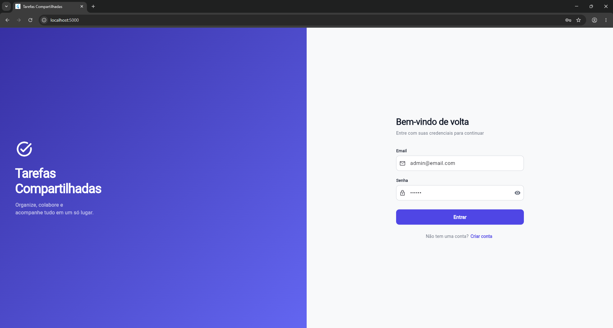
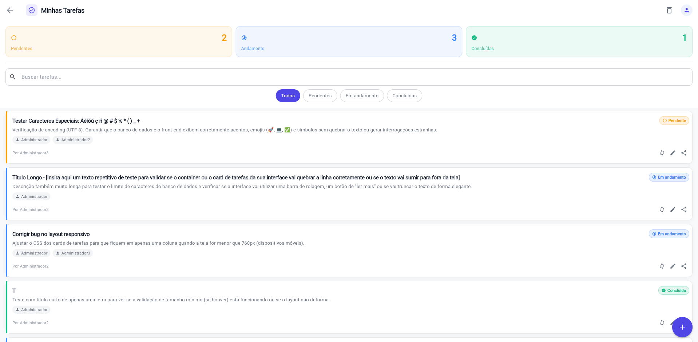
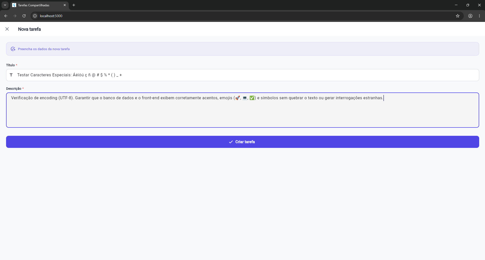
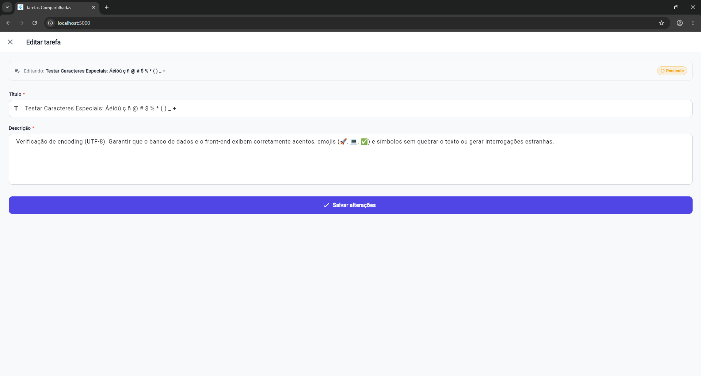
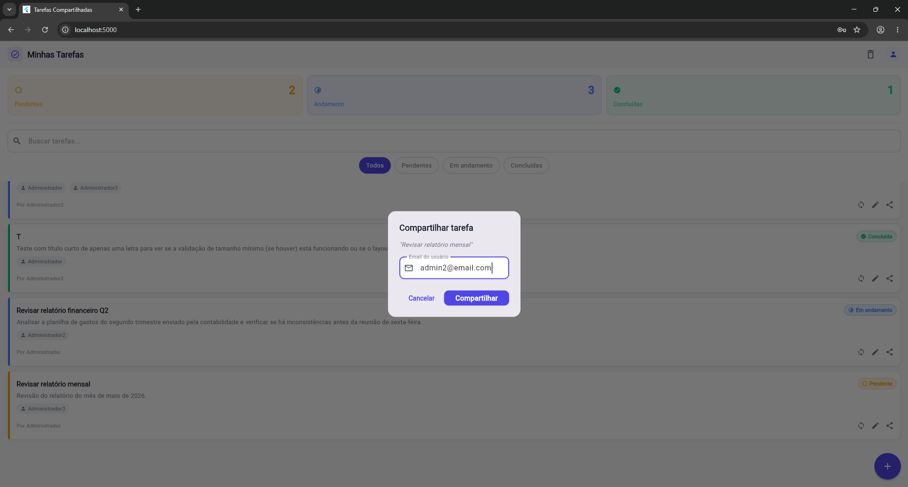
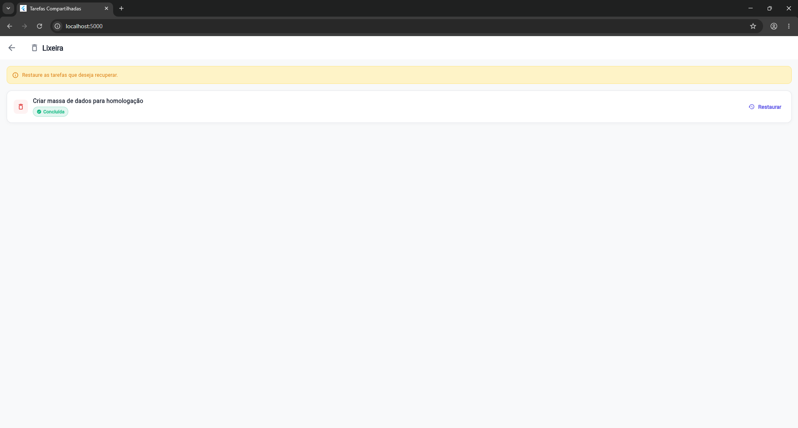

# Sistema de Tarefas Compartilhadas

Projeto fullstack desenvolvido com **Spring Boot** e **Flutter Web** para gerenciamento de tarefas colaborativas com autenticação JWT, compartilhamento entre usuários e permissões de acesso.

---

# Demonstração

## Screenshots

### Login



### Home



### Criar Tarefa



### Editar Tarefa



### Compartilhamento



### Lixeira



## Funcionalidades implementadas

### Autenticação
- Cadastro de usuários
- Login com JWT
- Refresh token
- Persistência de sessão
- Controle de acesso autenticado

### Gerenciamento de tarefas
- Criar tarefas
- Editar tarefas
- Atualizar status
- Excluir tarefas (soft delete)
- Restaurar tarefas da lixeira
- Dashboard com resumo de tarefas
- Busca por texto
- Filtro por status
- Paginação

### Colaboração entre usuários
- Compartilhar tarefa por email
- Controle de permissões
- Usuário compartilhado pode alterar status
- Usuário compartilhado não pode editar ou excluir
- Remoção de compartilhamento

### Frontend Flutter
- Interface web funcional
- Dashboard de tarefas
- Tela de login
- Tela de cadastro
- Tela de detalhes
- Tela de lixeira
- Atualização dinâmica da interface
- Snackbars e tratamento de erros

---

# Tecnologias utilizadas

## Backend
- Java 17
- Spring Boot
- Spring Security
- JWT
- Spring Data JPA
- Hibernate
- PostgreSQL
- Docker
- Swagger/OpenAPI
- Maven

## Frontend
- Flutter Web
- Dart
- HTTP
- Shared Preferences
- Material 3

---

# Arquitetura

## Backend
Arquitetura em camadas:

- Controller
- Service
- Repository
- DTO
- Exception Handler
- Security

## Frontend
Separação por:

- Pages
- Services
- Models
- Storage
- Config

---

# Funcionalidades de destaque

## Compartilhamento com permissões
O sistema possui compartilhamento de tarefas entre usuários utilizando uma entidade própria de permissões:

- LEITURA
- EDICAO_STATUS
- EDICAO_TOTAL

Atualmente o compartilhamento padrão utiliza:

```text
EDICAO_STATUS
```

Isso permite que usuários compartilhados atualizem o status da tarefa sem alterar ou excluir seu conteúdo.

---

# Como executar o projeto

## Backend

### Requisitos
- Java 17
- Docker Desktop
- Maven

### Executar

```bash
cd backend/tarefas-api
./mvnw clean package -DskipTests
```

Depois:

```bash
docker compose up --build
```

Backend:

```text
http://localhost:8080
```

Swagger:

```text
http://localhost:8080/swagger-ui/index.html
```

---

## Frontend

### Requisitos
- Flutter SDK
- Chrome

### Executar

```bash
cd frontend/tarefas_app
flutter pub get
flutter run -d chrome --web-port 5000
```

Frontend:

```text
http://localhost:5000
```

---

# Banco de dados

Banco utilizado:

```text
PostgreSQL
```

Executado via Docker.

---

# Estrutura do projeto

```text
projeto-tarefas/
│
├── backend/
│   └── tarefas-api/
│
├── frontend/
│   └── tarefas_app/
│
└── README.md
```

---

# Principais endpoints

## Autenticação

```http
POST /auth/register
POST /auth/login
POST /auth/refresh
```

## Tarefas

```http
GET    /tarefas/minhas
POST   /tarefas
PUT    /tarefas/{id}
PUT    /tarefas/{id}/status
DELETE /tarefas/{id}
PUT    /tarefas/{id}/restaurar
GET    /tarefas/deletadas
```

## Compartilhamento

```http
PUT    /tarefas/{id}/compartilhar
DELETE /tarefas/{id}/compartilhar/{usuarioId}
```

---

# Melhorias futuras

- Deploy em nuvem
- Upload de anexos
- Notificações
- Tema dark mode
- Testes automatizados completos
- Refresh token persistido
- Roles e permissões avançadas
- Responsividade mobile aprimorada

---

# Autor

## Francisco Maximino Grifoni Billar

Projeto desenvolvido para estudos, portfólio e aprimoramento em desenvolvimento fullstack.

LinkedIn e GitHub serão adicionados posteriormente.

